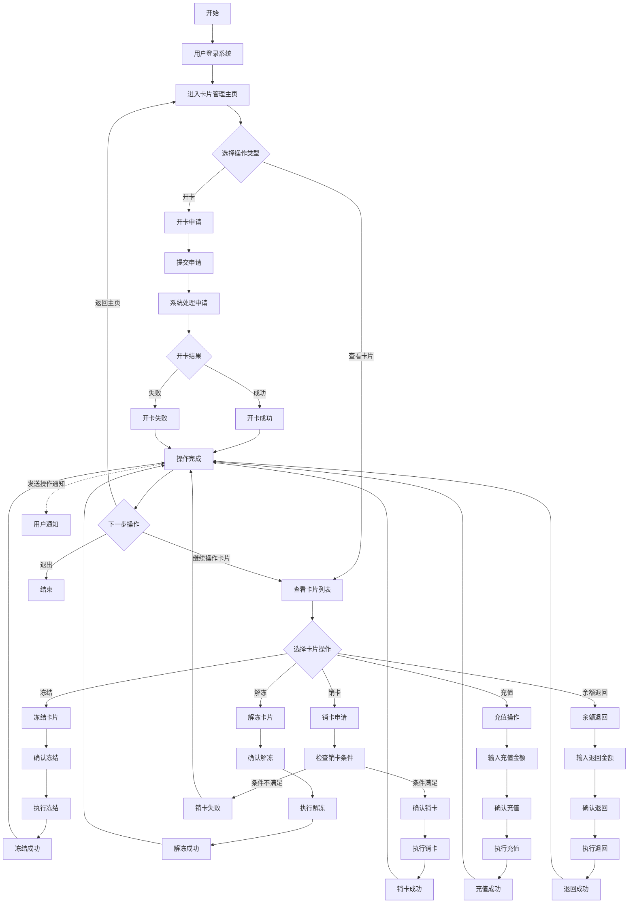

# 卡片管理系统 PRD（Product Requirements Document）

> 版本：v1.0  
> 更新日期：2026-02-13  
> 作者：产品团队

---

## 1. 产品概述

### 1.1 产品背景
本系统为虚拟/实体卡片的全生命周期管理平台，用户可通过系统完成开卡、充值、冻结、解冻、销卡、余额退回等操作。系统面向 B 端商户或 C 端用户，支持多卡管理和实时操作通知。

### 1.2 目标用户
- 持卡用户（个人/企业）
- 卡片管理后台运营人员

### 1.3 核心价值
- 一站式管理所有卡片的全生命周期
- 操作流程清晰，关键步骤均有二次确认
- 实时操作通知，确保用户感知

---

## 2. 系统业务流程图

---

## 3. 功能模块详细需求

---

### 3.1 用户登录

#### 3.1.1 登录方式
- 支持 **账号+密码** 登录
- 支持 **手机号+验证码** 登录
- 支持 **SSO 企业单点登录**（B 端场景）

#### 3.1.2 安全规则
- 密码要求：至少 8 位，须包含大小写字母和数字
- 连续输错密码 **5 次**，账户锁定 **30 分钟**
- 验证码有效期 **5 分钟**，同一手机号每日最多发送 **10 次**
- 登录成功后生成 Token，Token 有效期 **2 小时**，支持自动续期
- 异地登录需触发二次验证（短信/邮件）

#### 3.1.3 登录后跳转
- 登录成功 → 跳转至卡片管理主页（Dashboard）
- 登录失败 → 停留在登录页，显示错误原因（密码错误 / 账户已锁定 / 验证码过期）

---

### 3.2 卡片管理主页（Dashboard）

#### 3.2.1 页面布局
- **顶部统计栏**：显示总卡片数、活跃卡片数、冻结卡片数、总余额
- **快捷操作入口**：开卡申请、充值、余额退回
- **卡片列表区域**：展示所有卡片概览

#### 3.2.2 卡片列表展示
每张卡片展示以下信息：
| 字段 | 说明 |
|------|------|
| 卡号 | 显示后 4 位，其余用 **** 遮盖 |
| 卡片名称 | 用户自定义名称（可编辑） |
| 卡片类型 | 虚拟卡 / 实体卡 |
| 状态 | 活跃、冻结、已销卡 |
| 余额 | 当前可用余额，精确到 2 位小数 |
| 币种 | USD / EUR / CNY 等 |
| 创建时间 | 格式 YYYY-MM-DD HH:mm:ss |
| 操作 | 根据卡片当前状态显示可用操作按钮 |

#### 3.2.3 卡片状态与可用操作矩阵
| 卡片状态 | 可用操作 |
|----------|----------|
| 活跃 | 冻结、充值、余额退回、销卡 |
| 冻结 | 解冻、销卡 |
| 已销卡 | 无操作（仅查看历史） |

#### 3.2.4 筛选与排序
- 支持按状态筛选：全部 / 活跃 / 冻结 / 已销卡
- 支持按创建时间排序：最新 / 最早
- 支持按余额排序：高到低 / 低到高
- 支持按卡号后 4 位搜索

---

### 3.3 开卡申请

#### 3.3.1 开卡入口
- 主页点击 **"+ 开卡申请"** 按钮
- 进入开卡申请主页面

#### 3.3.2 卡申请主页面 — 基本信息填写区域

| 字段 | 类型 | 必填 | 默认值 | 校验/说明 |
|------|------|------|--------|-----------|
| 币种 | 固定展示 | — | USD | 固定展示 USD，不可修改 |
| 卡组织 | 固定展示 | — | Mastercard | 固定展示 Mastercard，不可修改 |
| 卡 BIN | 固定展示 | — | 系统默认分配的卡 BIN | 系统提示文字："Identifies the card issuer, network, and type. The system automatically assigns a suitable BINs based on your selected scenario, currency." |
| 用卡人 | 下拉选择 | 是 | — | 占位符："请选择用卡人"；下拉列表仅显示**状态正常**的用卡人；提供 **"+ 新建"** 链接，点击后跳转用卡人创建页 |
| 单笔限额 | 数字输入框 | 是 | 20,000.00 | 最小值 **100 USD**，必须为正数，精确到 2 位小数 |
| 单日限额 | 数字输入框 | 是 | 等于单笔限额 | 不能小于单笔限额，可独立设置 |
| 单月限额 | 数字输入框 | 是 | 等于单笔限额 | 不能小于单日限额，可独立设置 |

**限额校验规则：**
- 单笔限额必须为正数，不能小于 100 USD
- 单日限额 ≥ 单笔限额
- 单月限额 ≥ 单日限额

#### 3.3.3 卡申请主页面 — 卡片昵称

| 规则项 | 说明 |
|--------|------|
| 字符类型 | 支持中英文、数字 |
| 必填 | 是 |
| 默认值 | 自动填入所选用卡人名称，客户可修改 |
| 最大长度 | 20 字符 |
| 空格规则 | 不能全为空格 |
| 唯一性 | **不要求唯一**，可与同用户下其他卡片昵称重复 |

#### 3.3.4 卡申请主页面 — 充值信息区域

| 字段 | 类型 | 必填 | 校验/说明 |
|------|------|------|-----------|
| 单卡充值金额 | 数字输入框 | 是 | 规则见下方 |
| 支付账户 | 固定展示 | — | 本期默认为 USD 账户，不可选择。后续可拓展为商户已开通的所有币种账户 |

**单卡充值金额规则：**

| 场景 | 最小充值金额 | 说明 |
|------|-------------|------|
| 免费卡数量 = 0（即无免费开卡额度） | **100 USD** | 不能开 0 元卡，必须充值 |
| 免费卡数量 ≠ 0（有免费开卡额度） | **0 USD** | 允许 0 元开卡 |

#### 3.3.5 卡申请主页面 — 费用说明区域

- 显示 **"开卡费用 XX USD"**，金额根据当前配置**实时计算展示**
- 费用包含开卡服务费等

#### 3.3.6 卡申请主页面 — 操作按钮

**立即申请按钮：**
1. 点击后先执行前端校验（所有输入字段必填、限额规则校验）
2. 校验**支付总计金额**与**币种账户余额**：
   - 若支付总计金额 **≥** 币种账户余额 → **拦截**，提示"余额不足"
   - 若余额足够 → 跳转**支付密码输入弹窗**
3. 支付密码输入页面根据系统的统一格式展示

**取消按钮：**
- 点击后返回**卡片列表页**

#### 3.3.7 表单校验规则汇总

| 校验项 | 规则 |
|--------|------|
| 所有输入字段 | 必填项，不可为空 |
| 单笔限额 | 必须为正数，不能小于 100 USD |
| 单日限额 | 不能小于单笔限额 |
| 单月限额 | 不能小于单日限额 |
| 卡片昵称 | 不能全为空格，最大 20 字符 |
| 单卡充值金额 | 根据免费卡数量决定最小值（0 或 100 USD） |
| 支付总计金额 | 不能大于等于币种账户余额 |

#### 3.3.8 跳转逻辑

| 触发操作 | 跳转目标 |
|----------|----------|
| 立即申请按钮（校验通过） | 支付密码输入弹窗（系统统一格式） |
| 取消按钮 | 卡片列表页 |
| 用卡人"+ 新建"链接 | 用卡人创建页 |

#### 3.3.9 系统处理申请
- 后端校验用户资质（KYC 状态、账户额度）
- 检查用户已持卡数量是否达到上限（个人用户上限 **10 张**，企业用户上限 **50 张**）
- 调用发卡服务生成卡号
- 处理初始充值（如有）
- 扣除开卡费用

#### 3.3.10 卡申请结果页 — 开卡中（In Progress）

**页面元素与功能：**

**状态显示区域：**
- 标题："**Card creation in progress**"
- 状态图标：**加载动画**（转圈/进度条）
- 状态文本："**In progress**"

**进度提示文字：**
> Your card creation request is being processed. Card creation records You can check the detailed status in the card list.

**卡片信息表格：**

| 字段 | 说明 |
|------|------|
| Card number | 新生成的卡号（显示完整或部分遮盖） |
| Expiry Date | 卡片有效期 |
| CVV | 安全码（初始可能隐藏，需点击查看） |
| Currency | 币种（USD） |
| Card issuance fee | 开卡费用金额 |
| Status | 当前状态（In progress / Active / Failed） |

#### 3.3.11 开卡结果

**成功：**
- 卡片信息表格中 Status 更新为 **"Active"**
- 卡片列表页可见新卡
- 发送开卡成功通知（站内信 + 短信/邮件）

**失败：**
- 卡片信息表格中 Status 更新为 **"Failed"**
- 显示失败原因，可能的失败原因包括：
  - KYC 审核未通过
  - 持卡数量达到上限
  - 发卡服务异常
  - 充值金额超出账户可用余额
  - 支付密码错误
- 提供 **"重新申请"** 和 **"返回卡片列表"** 按钮

---

### 3.4 冻结卡片

#### 3.4.1 触发条件
- 卡片状态必须为 **"活跃"**
- 用户在卡片列表或卡片详情页点击 **"冻结"** 按钮

#### 3.4.2 确认冻结
- 弹出确认对话框：
  - 标题："确认冻结卡片"
  - 内容："冻结后该卡片将无法进行任何交易，但余额保留。确认冻结卡片 **** XXXX 吗？"
  - 按钮：**"确认冻结"**（主按钮，红色）/ **"取消"**
- 需要输入登录密码或短信验证码进行二次验证

#### 3.4.3 执行冻结
- 调用冻结接口，将卡片状态变更为 **"冻结"**
- 冻结期间：
  - 卡片不可用于任何消费或交易
  - 卡片余额保留，不可充值、不可退回
  - 挂起中的交易将被拒绝

#### 3.4.4 冻结成功
- 显示成功提示："卡片 **** XXXX 已成功冻结"
- 卡片列表中状态更新为"冻结"，按钮变为"解冻"
- 发送冻结通知

---

### 3.5 解冻卡片

#### 3.5.1 触发条件
- 卡片状态必须为 **"冻结"**
- 用户点击 **"解冻"** 按钮

#### 3.5.2 确认解冻
- 弹出确认对话框：
  - 标题："确认解冻卡片"
  - 内容："解冻后该卡片将恢复正常使用。确认解冻卡片 **** XXXX 吗？"
  - 按钮：**"确认解冻"**（主按钮，绿色）/ **"取消"**
- 需要输入登录密码或短信验证码进行二次验证

#### 3.5.3 执行解冻
- 调用解冻接口，将卡片状态变更为 **"活跃"**
- 解冻后卡片恢复所有功能（消费、充值、退回等）

#### 3.5.4 解冻成功
- 显示成功提示："卡片 **** XXXX 已成功解冻，恢复正常使用"
- 卡片列表中状态更新为"活跃"
- 发送解冻通知

---

### 3.6 销卡

#### 3.6.1 触发条件
- 卡片状态为 **"活跃"** 或 **"冻结"** 均可发起销卡
- 用户点击 **"销卡"** 按钮

#### 3.6.2 检查销卡条件
系统自动检查以下条件，**全部满足**方可继续：

| 检查项 | 规则 | 不满足时提示 |
|--------|------|--------------|
| 卡片余额 | 余额必须为 0，或用户同意将余额退回 | "该卡片还有余额 $XX.XX，请先完成余额退回操作" |
| 挂起交易 | 不存在未完成的交易 | "该卡片有 X 笔挂起中的交易，请等待交易完成后再销卡" |
| 分期账单 | 不存在未结清的分期 | "该卡片有未结清的分期账单，请先还清" |
| 冻结资金 | 不存在被冻结的资金 | "该卡片有 $XX.XX 冻结资金，请等待解冻后再销卡" |

#### 3.6.3 确认销卡
- 弹出确认对话框（条件全部满足后）：
  - 标题："⚠️ 确认销卡"
  - 内容："销卡操作不可撤销！卡片 **** XXXX 将被永久注销，卡号不可恢复。确认继续吗？"
  - 要求用户 **手动输入卡号后 4 位** 确认
  - 按钮：**"确认销卡"**（红色，需等待 5 秒倒计时后可点击）/ **"取消"**

#### 3.6.4 销卡失败
- 如果销卡条件不满足，显示具体不满足的条件列表
- 提供对应的操作建议（如"前往余额退回"链接）

#### 3.6.5 执行销卡
- 调用销卡接口
- 卡片状态变更为 **"已销卡"**
- 清除卡片关联的所有定期扣款授权
- 保留卡片历史交易记录（可查看但不可操作）

#### 3.6.6 销卡成功
- 显示成功页面："卡片 **** XXXX 已成功注销"
- 主页统计数据实时更新
- 发送销卡通知

---

### 3.7 充值操作

#### 3.7.1 触发条件
- 卡片状态必须为 **"活跃"**
- 用户点击 **"充值"** 按钮

#### 3.7.2 输入充值金额
- 充值金额输入规则：

| 规则项 | 说明 |
|--------|------|
| 最小充值金额 | 1.00（对应币种最小单位） |
| 最大单笔充值 | 50,000.00 |
| 单日充值上限 | 100,000.00 |
| 小数精度 | 精确到 2 位小数 |
| 金额校验 | 不允许输入负数、零、非数字字符 |

- 页面显示：
  - 当前卡片余额
  - 充值后预计余额
  - 账户可用余额（充值来源）
  - 如充值金额超出账户可用余额，"确认充值"按钮置灰，提示"账户余额不足"

#### 3.7.3 确认充值
- 展示充值确认信息：
  - 目标卡片：**** XXXX
  - 充值金额：$XXX.XX
  - 充值后余额：$XXX.XX
  - 资金来源：主账户余额
- 需要输入 **支付密码** 确认

#### 3.7.4 执行充值
- 调用充值接口
- 从用户主账户扣除对应金额
- 将金额加入卡片余额
- 操作原子性保证：扣款和加款在同一事务中完成

#### 3.7.5 充值成功
- 显示成功提示："充值 $XXX.XX 成功，当前卡片余额 $XXX.XX"
- 卡片列表余额实时更新
- 发送充值成功通知
- 生成充值流水记录

#### 3.7.6 充值失败场景
| 失败原因 | 提示信息 |
|----------|----------|
| 账户余额不足 | "账户可用余额不足，当前余额 $XX.XX" |
| 超出单日限额 | "今日充值累计已达上限 $100,000.00" |
| 支付密码错误 | "支付密码错误，还可尝试 X 次" |
| 系统异常 | "充值处理异常，资金未扣除，请稍后重试" |

---

### 3.8 余额退回

#### 3.8.1 触发条件
- 卡片状态必须为 **"活跃"**
- 卡片余额大于 0
- 用户点击 **"余额退回"** 按钮

#### 3.8.2 输入退回金额
- 退回金额输入规则：

| 规则项 | 说明 |
|--------|------|
| 最小退回金额 | 0.01（对应币种最小单位） |
| 最大退回金额 | 当前卡片可用余额（不含冻结金额） |
| 小数精度 | 精确到 2 位小数 |
| 全额退回 | 提供 **"全部退回"** 快捷按钮，自动填入可用余额全额 |

- 页面显示：
  - 当前卡片余额
  - 其中冻结金额（不可退回部分）
  - 可退回金额（= 余额 - 冻结金额）
  - 退回后预计余额

#### 3.8.3 确认退回
- 展示退回确认信息：
  - 来源卡片：**** XXXX
  - 退回金额：$XXX.XX
  - 退回后卡片余额：$XXX.XX
  - 退回目标：主账户余额
- 需要输入 **支付密码** 确认

#### 3.8.4 执行退回
- 调用余额退回接口
- 从卡片余额扣除对应金额
- 将金额加入用户主账户
- 操作原子性保证

#### 3.8.5 退回成功
- 显示成功提示："余额退回 $XXX.XX 成功，卡片当前余额 $XXX.XX"
- 卡片列表余额实时更新
- 发送退回成功通知
- 生成退回流水记录

#### 3.8.6 退回失败场景
| 失败原因 | 提示信息 |
|----------|----------|
| 可用余额不足 | "卡片可用余额不足，可退回金额 $XX.XX" |
| 存在挂起交易 | "该卡片有挂起中的交易，部分余额被冻结" |
| 支付密码错误 | "支付密码错误，还可尝试 X 次" |
| 系统异常 | "退回处理异常，资金未变动，请稍后重试" |

---

### 3.9 系统通知

#### 3.9.1 通知触发规则
以下操作完成后（无论成功或失败），均需发送通知：

| 操作类型 | 通知内容 | 通知渠道 |
|----------|----------|----------|
| 开卡成功 | "您已成功开通卡片 **** XXXX，初始余额 $XX.XX" | 站内信 + 短信 + 邮件 |
| 开卡失败 | "您的开卡申请未通过，原因：XXX" | 站内信 + 邮件 |
| 冻结卡片 | "您的卡片 **** XXXX 已被冻结" | 站内信 + 短信 |
| 解冻卡片 | "您的卡片 **** XXXX 已解冻，恢复正常使用" | 站内信 + 短信 |
| 销卡成功 | "您的卡片 **** XXXX 已成功注销" | 站内信 + 短信 + 邮件 |
| 充值成功 | "卡片 **** XXXX 充值 $XX.XX 成功" | 站内信 |
| 余额退回 | "卡片 **** XXXX 余额退回 $XX.XX 成功" | 站内信 |
| 异常交易 | "检测到卡片 **** XXXX 异常交易，已自动冻结" | 站内信 + 短信 + 邮件 |

#### 3.9.2 通知设置
- 用户可在设置中自定义通知偏好：
  - 开启/关闭短信通知
  - 开启/关闭邮件通知
  - 站内信始终开启，不可关闭
- 通知免打扰时间段设置（如 22:00 - 08:00 静音，紧急通知除外）

#### 3.9.3 站内信管理
- 通知列表支持已读/未读标记
- 支持批量标记已读、批量删除
- 未读通知在导航栏显示红色角标和数量

---

## 4. 非功能需求

### 4.1 性能要求
| 指标 | 要求 |
|------|------|
| 页面加载时间 | ≤ 2 秒（首屏） |
| API 响应时间 | ≤ 500ms（查询类）、≤ 3s（操作类） |
| 并发支持 | 至少 1000 并发用户 |
| 充值/退回操作 | 响应时间 ≤ 5s |
| 开卡操作 | 响应时间 ≤ 10s |

### 4.2 安全要求
| 安全项 | 要求 |
|--------|------|
| 敏感操作二次验证 | 冻结、解冻、销卡、充值、退回均需二次验证 |
| 支付密码 | 独立于登录密码，连续错 5 次锁定 24 小时 |
| 数据加密 | 卡号、证件号等敏感数据 AES-256 加密存储 |
| 传输加密 | 全站 HTTPS，TLS 1.2+ |
| 操作日志 | 所有操作记录审计日志，保留至少 3 年 |
| 异常检测 | 异常交易自动冻结并通知用户 |

### 4.3 可用性要求
- 系统可用性 ≥ 99.9%（月度）
- 计划内维护窗口：每月最多 2 次，每次不超过 30 分钟，提前 24 小时通知
- 故障恢复时间 ≤ 15 分钟

### 4.4 兼容性要求
- 浏览器：Chrome 90+、Firefox 88+、Safari 14+、Edge 90+
- 移动端：iOS 14+、Android 10+
- 分辨率：最小支持 375px 宽度（移动端适配）

---

## 5. 接口清单

| 接口 | Method | Path | 说明 |
|------|--------|------|------|
| 用户登录 | POST | /api/auth/login | 账号密码或手机验证码登录 |
| 获取卡片列表 | GET | /api/cards | 支持分页、筛选、排序 |
| 获取卡片详情 | GET | /api/cards/{card_id} | 返回单张卡片完整信息 |
| 开卡申请 | POST | /api/cards/apply | 提交开卡申请 |
| 冻结卡片 | POST | /api/cards/{card_id}/freeze | 冻结指定卡片 |
| 解冻卡片 | POST | /api/cards/{card_id}/unfreeze | 解冻指定卡片 |
| 销卡 | POST | /api/cards/{card_id}/cancel | 销卡（需满足条件） |
| 充值 | POST | /api/cards/{card_id}/recharge | 向指定卡片充值 |
| 余额退回 | POST | /api/cards/{card_id}/refund | 将卡片余额退回主账户 |
| 获取交易记录 | GET | /api/cards/{card_id}/transactions | 获取卡片交易流水 |
| 获取通知列表 | GET | /api/notifications | 获取用户通知列表 |
| 标记通知已读 | PUT | /api/notifications/{id}/read | 标记单条通知已读 |
| 通知设置 | PUT | /api/user/notification-settings | 更新通知偏好 |

---

## 6. 异常处理与边界场景

### 6.1 网络异常
- 操作过程中网络中断，前端显示"网络异常，请检查网络后重试"
- 充值/退回操作中断时，后端保证事务原子性，不会出现资金不一致
- 提供"重试"按钮

### 6.2 并发冲突
- 同一卡片同时被多处操作时（如同时冻结和充值），后端使用乐观锁处理
- 后操作返回"卡片状态已变更，请刷新后重试"

### 6.3 会话超时
- 用户长时间（超过 30 分钟）未操作，Token 过期
- 操作时检测到 Token 过期，弹出登录对话框，登录后自动恢复当前操作

### 6.4 金额精度
- 所有金额计算使用 Decimal 精确运算，避免浮点误差
- 显示时统一保留 2 位小数
- 后端金额以最小货币单位（如"分"）存储为整数

---

## 7. 数据字典

### 7.1 卡片状态枚举
| 状态值 | 中文名 | 说明 |
|--------|--------|------|
| ACTIVE | 活跃 | 正常使用中 |
| FROZEN | 冻结 | 暂停使用，余额保留 |
| CANCELLED | 已销卡 | 永久注销，不可恢复 |

### 7.2 操作类型枚举
| 类型值 | 中文名 |
|--------|--------|
| APPLY | 开卡申请 |
| FREEZE | 冻结 |
| UNFREEZE | 解冻 |
| CANCEL | 销卡 |
| RECHARGE | 充值 |
| REFUND | 余额退回 |

### 7.3 通知渠道枚举
| 渠道值 | 说明 |
|--------|------|
| IN_APP | 站内信 |
| SMS | 短信 |
| EMAIL | 邮件 |
