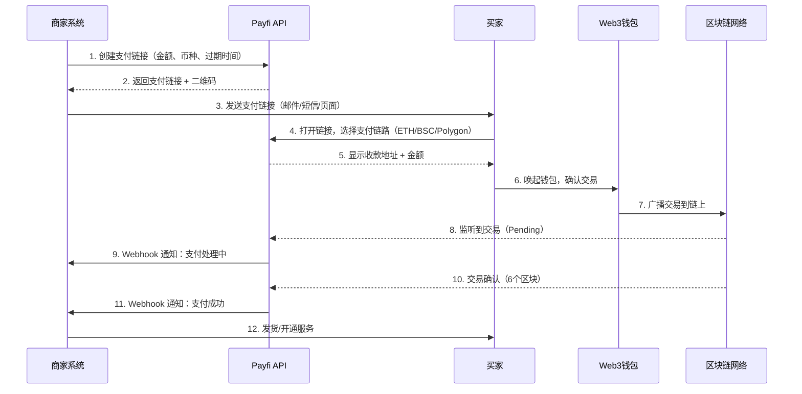
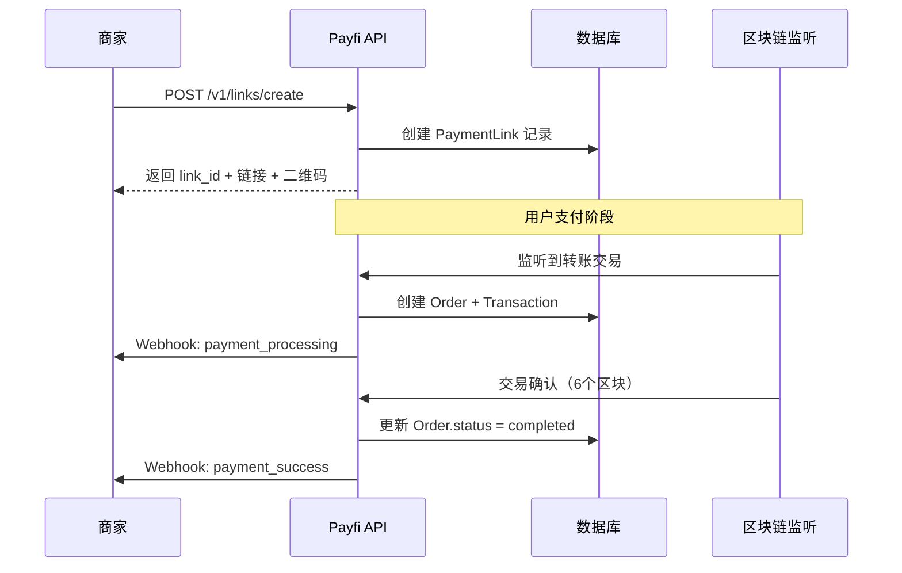

# 【PRD】Payfi 收单需求文档

> 版本：v1.0  
> 作者：产品团队  
> 日期：2026-02-12  
> 状态：待评审

---

## 1. 基础信息

### 1.1 版本/Version
- **当前版本**：v1.0
- **更新日期**：2026-02-12
- **文档状态**：Draft

### 1.2 背景和目标

#### 背景
随着 Web3 和加密货币的普及，越来越多的商家希望接受加密货币支付。传统支付网关（Stripe、PayPal）无法支持链上支付，市场需要一个简单、安全、合规的 Crypto 支付解决方案。

#### 目标
1. **商家侧**：提供一键生成支付链接的能力，支持法币定价、自动汇率转换、多币种收款。
2. **用户侧**：支持交易所钱包、Web3 钱包（MetaMask、Trust Wallet 等）快速支付。
3. **平台侧**：提供订单管理、资金对账、风控预警、数据分析能力。

#### 核心价值
- 降低商家接入 Crypto 支付的技术门槛（无需懂区块链）
- 提升用户支付体验（支持主流钱包、秒级确认）
- 保障资金安全与合规（多签钱包、AML 检测、KYT）

### 1.3 一句话需求
**支持商家以法币（USD）或稳定币（USDT、USDC）创建一条支付链接，用户打开链接后可通过交易所钱包、Web3 钱包支付稳定币完成付款。**

### 1.4 范围

#### 本期范围（V1.0）
- ✅ One-time Links API（一次性支付链接）
- ✅ 交易订单记账系统
- ✅ 支持 USDT/USDC 在 ETH、BSC、Polygon、Arbitrum 链上支付
- ✅ 预警通知（超时、异常、大额）
- ✅ 商家后台（订单查询、对账）
- ✅ Webhook 回调通知
- ✅ 交易路由（自动选择最优链路）

#### 暂不支持（后续迭代）
- ❌ 订阅支付（Recurring Payment）
- ❌ 退款功能
- ❌ 多币种支付（BTC、ETH、SOL）
- ❌ NFT 支付
- ❌ Shoplazza 深度集成

### 1.5 必看的 Crypto 付款流程



---

## 2. 产品概要设计//Outline design

### 2.1 产品功能架构图（Function Architecture）

```
┌─────────────────────────────────────────────────────────────┐
│                        Payfi 收单系统                         │
├─────────────────────────────────────────────────────────────┤
│                                                               │
│  ┌──────────────┐  ┌──────────────┐  ┌──────────────┐      │
│  │  商家后台    │  │   API 网关   │  │  支付页面    │      │
│  │ Dashboard    │  │  RESTful API │  │  Payment UI  │      │
│  └──────┬───────┘  └──────┬───────┘  └──────┬───────┘      │
│         │                  │                  │              │
│  ┌──────┴──────────────────┴──────────────────┴───────┐    │
│  │                   业务逻辑层                         │    │
│  ├──────────────────────────────────────────────────────┤    │
│  │ 支付链接管理 │ 订单管理 │ 汇率服务 │ 风控引擎 │      │    │
│  │ 账务对账     │ Webhook  │ 路由策略 │ 预警通知 │      │    │
│  └──────────────────────────┬───────────────────────────┘    │
│                              │                                │
│  ┌───────────────────────────┴────────────────────────┐     │
│  │                   基础设施层                        │     │
│  ├─────────────────────────────────────────────────────┤     │
│  │ 链上监听服务 │ 多签钱包 │ 数据库 │ 消息队列 │       │     │
│  │ KYT/AML      │ 加密存储 │ 日志   │ 监控告警 │       │     │
│  └─────────────────────────────────────────────────────┘     │
│                                                               │
└─────────────────────────────────────────────────────────────┘
```

### 2.2 领域模型与数据说明（Domain Model）

#### 核心实体

| 实体 | 说明 | 核心字段 |
|------|------|---------|
| **Merchant** | 商家 | merchant_id, api_key, settle_address, fee_rate |
| **PaymentLink** | 支付链接 | link_id, amount, currency, expire_time, status |
| **Order** | 订单 | order_id, merchant_id, link_id, amount, chain, tx_hash, status |
| **Transaction** | 链上交易 | tx_hash, chain, from_address, to_address, amount, confirmations |
| **Webhook** | 回调记录 | webhook_id, order_id, url, payload, retry_count, status |
| **Settlement** | 结算记录 | settle_id, merchant_id, amount, fee, net_amount, settle_time |

#### 订单状态流转

```
创建 (created) 
  → 待支付 (pending_payment) 
  → 支付中 (processing) 
  → 已完成 (completed) / 已过期 (expired) / 异常 (failed)
```

### 2.3 用户动线框线图说明（User Flow）

#### 商家流程
1. 注册账号 → 完成 KYC → 获取 API Key
2. 调用 API 创建支付链接（或在后台手动创建）
3. 将链接发送给用户（邮件/短信/嵌入页面）
4. 接收 Webhook 通知，更新订单状态
5. 在后台查看订单、对账、提现

#### 用户流程
1. 收到支付链接，点击打开
2. 查看订单详情（金额、商品、过期时间）
3. 选择支付链路（ETH/BSC/Polygon）
4. 连接钱包（MetaMask/WalletConnect）
5. 确认交易并签名
6. 等待链上确认（显示进度）
7. 支付完成，跳转回商家页面

---

## 3. 产品详细需求、流程与界面（Detail Requirements）

### 3.1 One-time Links API

#### 3.1.1 时序图



#### 3.1.2 创建 One-time Link

**API: Create a One-time Link**

- **接口**：`POST /v1/links/create`
- **鉴权**：API Key（Header: `X-API-Key`）
- **请求参数**：

```json
{
  "amount": 100.00,               // 金额
  "currency": "USD",              // 币种（USD/USDT/USDC）
  "description": "订单 #12345",   // 描述
  "expire_minutes": 30,           // 过期时间（分钟）
  "merchant_order_id": "ORD123",  // 商家订单号（可选）
  "webhook_url": "https://example.com/webhook",  // 回调地址
  "redirect_url": "https://example.com/success",  // 成功跳转地址
  "metadata": {                   // 自定义元数据
    "user_id": "U123",
    "product": "VIP会员"
  }
}
```

- **响应示例**：

```json
{
  "code": 0,
  "message": "success",
  "data": {
    "link_id": "lnk_8x9a7b3c",
    "payment_url": "https://pay.payfi.io/lnk_8x9a7b3c",
    "qr_code": "data:image/png;base64,iVBORw0KG...",
    "amount": 100.00,
    "currency": "USD",
    "equivalent_usdt": 100.00,      // 等值 USDT
    "expire_at": "2026-02-12T12:30:00Z",
    "status": "pending_payment"
  }
}
```

- **业务规则**：
  - 金额范围：1 - 100,000 USD
  - 过期时间：5 - 1440 分钟
  - 链接创建后不可修改金额
  - 一个链接只能支付一次

#### 3.1.3 订单处理 - 使订单过期

**API: Expire One-time Link**

- **接口**：`POST /v1/links/{link_id}/expire`
- **说明**：手动使某个支付链接失效
- **响应**：

```json
{
  "code": 0,
  "message": "链接已失效",
  "data": {
    "link_id": "lnk_8x9a7b3c",
    "status": "expired"
  }
}
```

#### 3.1.4 订单查询

**API: Get One-time Link Info**

- **接口**：`GET /v1/links/{link_id}`
- **响应**：

```json
{
  "code": 0,
  "data": {
    "link_id": "lnk_8x9a7b3c",
    "amount": 100.00,
    "status": "completed",
    "paid_amount": 100.05,
    "paid_currency": "USDT",
    "paid_chain": "BSC",
    "tx_hash": "0xabc123...",
    "paid_at": "2026-02-12T12:15:30Z",
    "confirmations": 12
  }
}
```

**API: Get One-time Links (批量查询)**

- **接口**：`GET /v1/links?status=completed&page=1&limit=20`
- **过滤参数**：
  - `status`: pending_payment / processing / completed / expired
  - `start_date` / `end_date`
  - `merchant_order_id`

#### 3.1.5 Webhook

**回调时机**：
1. `payment.processing`：收到链上交易，未确认
2. `payment.success`：交易已确认（6个区块）
3. `payment.failed`：支付失败（金额不足、地址错误）
4. `payment.expired`：链接过期

**Payload 示例**：

```json
{
  "event": "payment.success",
  "link_id": "lnk_8x9a7b3c",
  "order_id": "ord_xyz789",
  "merchant_order_id": "ORD123",
  "amount": 100.00,
  "currency": "USD",
  "paid_amount": 100.05,
  "paid_currency": "USDT",
  "paid_chain": "BSC",
  "tx_hash": "0xabc123...",
  "from_address": "0xUser123...",
  "to_address": "0xMerchant456...",
  "confirmations": 12,
  "timestamp": "2026-02-12T12:15:30Z",
  "signature": "sha256_signature_here"
}
```

**安全校验**：
- 验证签名（HMAC-SHA256，密钥为商家的 API Secret）
- 幂等处理（根据 order_id 去重）
- 重试机制（失败后 1min、5min、30min、2h、24h 重试）

#### 3.1.6 驱动对账

商家可在后台下载对账单：
- 按日/周/月导出
- CSV 格式，包含：订单号、金额、手续费、实收金额、交易哈希、状态

#### 3.1.7 商家后台 -- 不做了（V2.0）
暂不实现完整后台，V1.0 仅提供 API，商家自行集成。

---

### 3.2 交易订单记账

#### 3.2.1 正常订单

**流程**：
1. 用户支付 → 创建 Order（status: processing）
2. 链上监听到交易 → 创建 Transaction 记录
3. 交易确认后 → Order.status = completed
4. 自动结算到商家钱包（扣除手续费）

**记账规则**：
- 商家实收 = 支付金额 - 手续费（默认 1%）
- 手续费计入平台收入

#### 3.2.2 少付订单

**场景**：用户实付金额 < 订单金额（如：订单 100 USDT，实付 95 USDT）

**处理逻辑**：
- 订单标记为 `underpaid`
- 不触发 Webhook `payment.success`
- 商家后台提示"金额不足"
- 选项：
  - 退回用户
  - 标记为部分完成（商家自行决定是否发货）

#### 3.2.3 多付订单

**场景**：用户实付金额 > 订单金额（如：订单 100 USDT，实付 105 USDT）

**处理逻辑**：
- 订单正常完成
- 多付部分自动退回用户
- Webhook 中标注 `overpaid: true`

#### 3.2.4 异常订单

**异常类型**：
1. **重复支付**：同一订单收到多笔转账 → 自动退回第二笔
2. **地址错误**：用户转错地址 → 人工审核处理
3. **币种错误**：要求 USDT，实付 USDC → 按汇率换算或退回
4. **链错误**：要求 BSC，实付 ETH → 需人工处理（跨链桥）

---

### 3.3 预警通知（不做了，V2.0）
- 大额支付（>10,000 USD）
- 高风险地址（黑名单、混币器）
- 异常频繁（同一地址 1 小时内 >10 笔）

---

### 3.4 交易路由 -- 本期不做
自动选择最优支付链路（手续费最低、速度最快）。

---

### 3.5 运营平台
管理后台（Admin Dashboard），功能：
- 商家管理（审核、配置费率、封禁）
- 订单监控（实时订单、异常订单）
- 财务报表（日收入、手续费、利润）
- 风控规则（黑名单、限额）

---

### 3.6 渠道接入
支持的钱包：
- MetaMask
- Trust Wallet
- WalletConnect（通用协议）
- 交易所钱包（Binance、OKX）

---

### 3.7 Shoplazza Payment（V2.0）
深度集成 Shoplazza 电商平台，支持：
- 在购物车自动生成支付链接
- 订单状态同步
- 退款流程

---

## 4. 非功能需求（Non-Functional Requirements）

### 4.1 性能要求
- 接口响应时间：P99 < 200ms
- 链上监听延迟：< 30s
- Webhook 送达率：> 99.5%
- 系统可用性：99.9%

### 4.2 安全要求
- API Key 加密存储
- HTTPS 强制加密
- 私钥冷存储（多签钱包）
- KYT/AML 检测（接入 Chainalysis）
- DDOS 防护

### 4.3 合规要求
- 商家必须通过 KYC
- 单日限额：10 万 USD（未认证），100 万 USD（已认证）
- 保留交易记录 7 年

### 4.4 扩展性
- 支持水平扩展（微服务架构）
- 数据库分库分表
- 支持后续接入更多公链（Solana、TRON）

---

## 5. 数据指标与埋点（Metrics & Analytics）

### 5.1 关键业务指标（Metrics）

| 指标 | 说明 | 目标 |
|------|------|------|
| **交易成功率** | 完成订单数 / 总订单数 | > 95% |
| **平均支付时长** | 从链接创建到支付完成 | < 5 分钟 |
| **Webhook 成功率** | 成功送达次数 / 总次数 | > 99% |
| **用户流失率** | 打开链接但未支付 | < 20% |
| **手续费收入** | 每日手续费总额 | - |

### 5.2 核心数据埋点/采集要求

#### 用户行为埋点
- `link_opened`：打开支付链接
- `wallet_connected`：连接钱包
- `payment_initiated`：发起支付
- `payment_confirmed`：支付确认
- `payment_failed`：支付失败

#### 业务数据埋点
- 每日订单量、交易额
- 各链路占比（ETH/BSC/Polygon）
- 钱包类型分布
- 异常订单类型统计

---

## 6. 项目计划//Project plan

| 阶段 | 时间 | 产出 |
|------|------|------|
| **需求评审** | Week 1 | PRD 终版 |
| **技术方案** | Week 2 | 技术架构文档 |
| **开发** | Week 3-8 | API + 链上监听 + 后台 |
| **测试** | Week 9-10 | 测试报告 |
| **灰度发布** | Week 11 | 邀请 10 家商家试用 |
| **正式上线** | Week 12 | 全量开放 |

---

## 7. 相关产品域//Related product domain
- 支付网关：Stripe、PayPal
- Crypto 支付：Coinbase Commerce、BitPay、NOWPayments
- Web3 基础设施：Alchemy、Infura、QuickNode

---

## 8. 渠道参考
- **钱包接入**：WalletConnect、MetaMask SDK
- **链上监听**：Moralis、The Graph
- **KYT/AML**：Chainalysis、Elliptic
- **汇率数据**：CoinGecko API、Binance API
